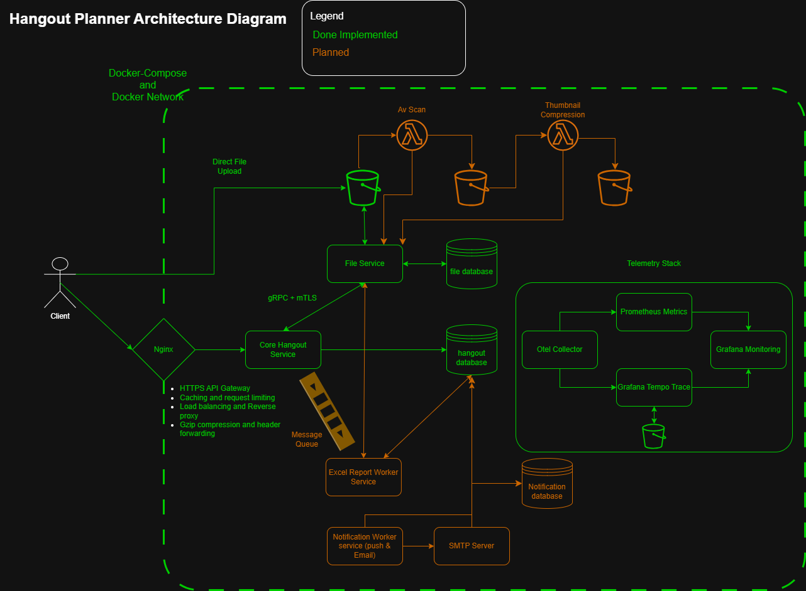

# Hangout Planner — Scalable Go Backend Platform

Hangout Planner is a production-oriented microservices backend system built in Go to simulate real-world scalable architecture.

This project demonstrates how distributed systems handle:

- Secure file uploads using presigned S3 URLs
- Service-to-service communication via gRPC secured with mTLS
- Independent service databases
- TLS termination and API gateway routing
- Distributed tracing and metrics instrumentation
- CI automation and schema migrations
- Containerized multi-service orchestration

The system mirrors real-world deployment topology:

**Gateway → Services → Databases → Object Storage → Observability Stack**

Built to deepen backend engineering skills in distributed systems, cloud-native architecture, and production observability.

## System Architecture



### High-Level Flow

1. Client sends HTTPS request to NGINX gateway
2. NGINX terminates TLS and routes traffic to the appropriate service
3. Hangout Service handles business logic and authentication
4. Hangout Service communicates with File Service over gRPC secured by mTLS
5. File Service generates presigned S3 URLs via AWS SDK (LocalStack in development)
6. Metrics and traces are exported via OpenTelemetry
7. Prometheus scrapes metrics
8. Grafana visualizes metrics and traces (via Tempo)

Each service:

- Owns its own database
- Exposes health endpoints
- Exposes Prometheus metrics
- Emits OpenTelemetry traces

## What Has Been Designed & Implemented

- Designed microservices boundaries and service contracts
- Implemented REST API using Echo (JWT auth, validation, middleware)
- Built gRPC File Service with mutual TLS authentication
- Designed presigned S3 upload workflow (no file bytes pass through API)
- Configured NGINX as TLS-terminating reverse proxy with HTTP/2
- Instrumented distributed tracing using OpenTelemetry
- Exposed Prometheus metrics and built Grafana dashboards
- Configured Grafana Tempo for end-to-end trace visibility
- Implemented database schema migrations using Atlas (diff/apply workflow)
- Built Docker Compose stack simulating production topology
- Implemented GitHub Actions CI pipeline (lint + tests + coverage)

## Tech Stack

**Backend**

- Go (services/hangout, services/file)
- Echo (HTTP server, routing, middleware)
- gRPC + Protocol Buffers (service-to-service communication)
- mTLS (mutual TLS authentication)
- JWT auth (echo-jwt)
- go-playground/validator (request validation)
- GORM + MySQL driver
- MySQL 8.0 (separate databases per service)
- Localstack (S3 Emulation)

**API & Documentation**

- OpenAPI/Swagger via swag + echo-swagger

**Infrastructure**

- Docker + Docker Compose (local orchestration)
- NGINX (reverse proxy, TLS termination, HTTP/2, gzip compression, header forwarding)
- LocalStack (local AWS S3 emulation for development)
- AWS SDK for Go v2 (S3 client, presigned URLs)

**Observability**

- OpenTelemetry (traces + metrics instrumentation)
- OpenTelemetry Collector
- Prometheus (metrics scraping)
- Grafana (dashboards and visualization)
- Grafana Tempo (distributed tracing backend)

**Engineering Practices**

- GitHub Actions CI (lint + tests + coverage artifact)
- golangci-lint
- Lefthook (local git hooks)
- Atlas migrations (schema diff/apply)
- Make (scripting)
- mkcert for one time cert generation

## Repository Layout

```
services/
  hangout/      → REST API service
  file/         → gRPC file lifecycle service

pkg/shared/     → Shared protobuf contracts

components/
  nginx/        → Gateway configuration
  database/     → DB bootstrap
  grafana/      → Dashboards
  prometheus/   → Metrics config
  tempo/        → Tracing backend
  otelcollector → OTel configuration

deployments/    → Docker Compose stack
```

## Local Development

### Prerequisites

- Go 1.24.11+
- Docker & Docker Compose
- Make
- Protocol Buffer compiler (protoc) with Go plugins
- Atlas CLI (migrations)
- Swag CLI (API docs)
- mkcert (one-time TLS certificate generation)

### Environment Setup

1. Copy `.env.example` to `.env` in each service directory
2. Generate TLS certificates (one-time): see `components/nginx/README.md`
3. Start dependencies stack (database, localstack, observability stack)
4. Start services: `make up`
5. Run migrations: `cd services/hangout && make migrate && cd ../file && make migrate`

Each service has its own database. Set `{SERVICE}_DB_URL` environment variables for Atlas migrations.

---

## Existing Features

### Microservices Architecture

- **Hangout Service**: REST API with JWT auth, batch DB operations, Swagger docs
- **File Service**: gRPC file lifecycle management with mTLS authentication
- **Protocol Buffers**: Shared contracts in `pkg/shared` for service communication
- **Separate databases**: Each service owns its schema with Atlas migrations
- Docker-based service discovery

### File Upload Architecture

- Client-side upload via presigned S3 URLs (no file bytes through API)
- Batch operations for multi-file uploads with rollback support
- LocalStack S3 for development (AWS-compatible)
- AES-256 encryption, MD5 checksums, 15-minute URL expiry
- Max 10 files per upload, 10MB per file
- Supported formats: `.jpg`, `.jpeg`, `.png`, `.gif`, `.webp`

### Security

- mTLS for service-to-service communication (Hangout ↔ File)
- JWT authentication for client requests
- TLS termination at Nginx gateway
- Certificate-based authentication with CA validation
- Strict upload validation and content-type enforcement

### Observability

- OpenTelemetry instrumentation in both services
- HTTP and gRPC trace propagation across service boundaries
- Prometheus metrics exposure per service
- Grafana dashboards for:
  - Service latency
  - Request throughput
  - Error rates
  - File upload performance
- Distributed tracing via Grafana Tempo
- End-to-end trace visibility from API request → gRPC call → S3 interaction

### Infrastructure

- **Docker Compose**: Multi-service orchestration with health checks and restart policies
- **Nginx**: API gateway with reverse proxy, HTTP/2, TLS termination, rate limiting, and load balancing
- **LocalStack**: AWS-compatible S3 emulation for local development with persistence
- **GitHub Actions**: CI/CD pipeline for linting, testing, and coverage reporting

### Tooling

- **Make**: Automation scripts for common tasks (build, test, migrate, up/down)
- **Air**: Live reload for Go services during development
- **Swag**: OpenAPI/Swagger documentation generation from code annotations
- **golangci-lint**: Comprehensive Go linting with multiple checkers
- **Lefthook**: Git hooks for pre-commit and pre-push automation
- **mkcert**: Local TLS certificate generation for HTTPS development
- **Atlas**: Database schema migrations with diff and apply capabilities

## Long-Term Vision

- Port protection and stricter network segmentation
- RBAC for multi-user scenarios
- OAuth / federated logins
  - Redis caching layer for session management and rate limiting
- Excel export service
  - RabbitMQ service interconnect
  - background worker service
- Notification Emails + SMTP
- Implement file scanning using opengovsg [lambda-virus-scanner](https://github.com/opengovsg/lambda-virus-scanner) + 3 S3 buckets architecture (dirty, clean, and thumbnail / resized image bucket)
