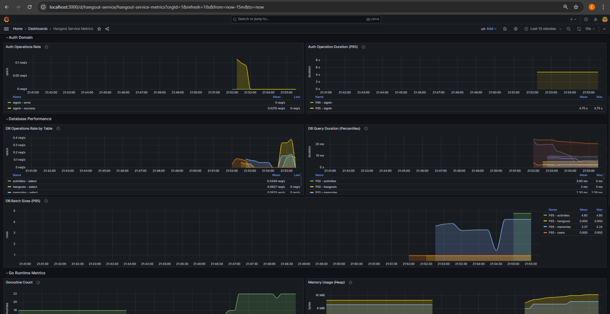
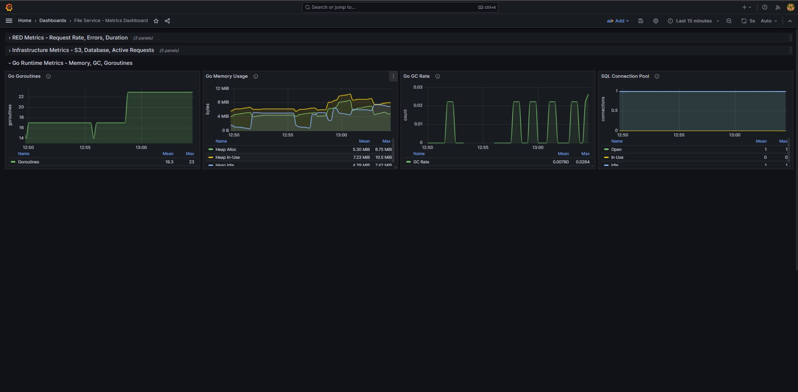
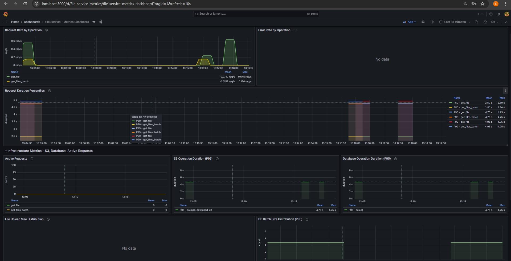
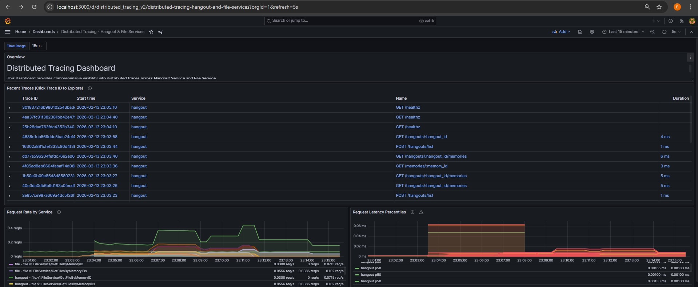

# Observability Stack — Grafana Dashboards & Distributed Tracing & Prometheus Metrics

This directory documents the observability layer for Hangout Planner.

The system is instrumented using OpenTelemetry and exports telemetry to a centralized stack composed of:

- Prometheus — metrics scraping
- Grafana — dashboard visualization
- Grafana Tempo — distributed tracing backend
- OpenTelemetry Collector — telemetry aggregation and export

All services expose metrics and propagate trace context across service boundaries.

## Architecture Overview

Telemetry Flow:

```
Services (HTTP + gRPC)
        ↓
OpenTelemetry SDK
        ↓
OpenTelemetry Collector
        ↓
Prometheus (metrics) + Tempo (traces)
        ↓
Grafana Dashboards
```

Both Hangout Service and File Service emit:

- RED metrics (Rate, Errors, Duration)
- gRPC latency histograms
- HTTP request duration
- Database query timings
- Storage interaction timings
- Distributed traces

## Dashboards

### Hangout Service Metrics

#### Database and Request Throughput & Latency



This dashboard visualizes:

- Service request rate
- Latency percentiles (P50, P95, P99)
- Database interaction timing

#### Runtime, Database, and gRPC Client Metrics


This dashboard visualizes:

- Go Runtime Metrics
- Database connection pool metrics
- gRPC Client Metrics

### File Service Metrics

#### Runtime Metrics



This dashboard visualizes:

- Go Runtime Metrics

#### S3, gPRC, Error Rate, File statistics



This dashboard visualizes:

- RED metrics (Rate, Errors, Duration)
- S3 Metrics
- Error rate tracking
- Route-level performance

---

## Distributed Tracing



Grafana Tempo is used as the distributed tracing backend.

Traces are generated via OpenTelemetry instrumentation in:

- Echo HTTP middleware (Hangout Service)
- gRPC client (Hangout → File)
- gRPC server (File Service)
- Database calls
- S3 client operations

This enables full end-to-end request visibility.

### Example Trace - Get Memories From Each Hangout


This trace demonstrates:

1. Incoming HTTP request to Hangout Service
2. Business logic execution
3. gRPC call to File Service
4. Database queries
5. S3 interaction

Benefits:

- Cross-service latency breakdown
- Identification of slow downstream dependencies
- Root cause analysis
- Validation of trace context propagation
